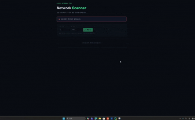

# Network Scanner

> 같은 네트워크에 연결된 기기를 탐색하고, 각 기기의 열린 포트와 프로토콜을 확인하는 웹 기반 스캐너입니다.
> Wireshark·Nmap의 동작 원리를 직접 구현하며 네트워크 스캐닝을 학습할 목적으로 만들었습니다.

**작성자** 이정원 · **분야** 네트워크 보안

> ⚠️ **본인 소유 네트워크 전용** — 허가받지 않은 외부 네트워크 스캔은 법적 문제가 될 수 있어, 로컬(본인 와이파이) 환경에서만 사용하도록 설계했습니다.

---

## 데모



> 네트워크 연결이 끊기면 스캔 패널이 비활성화되고, 다시 연결되면 자동으로 활성화됩니다.

---

## 주요 기능

- **실시간 네트워크 상태 감지** — Wi-Fi 인터페이스 상태를 3초 주기로 확인해, 끊기면 스캔을 비활성화하고 연결되면 자동 활성화
- **기기 탐색** — ARP 스캔으로 같은 대역의 기기 IP·MAC 수집
- **포트 스캔** — 지정한 범위의 열린 포트를 멀티스레드로 빠르게 탐색
- **프로토콜 매핑** — 열린 포트에 해당하는 서비스명(HTTP, SSH 등) 표시
- **웹 GUI** — 게이트웨이·내 PC 자동 구분 표시

---

## 실행 방법

```bash
# 1. 의존성 설치
pip install -r requirements.txt

# 2. 실행 (ARP 스캔은 관리자 권한 필요)
python app.py
```

브라우저에서 `http://127.0.0.1:5000` 접속

> **Windows 사용자** — scapy가 패킷을 전송하려면 [Npcap](https://npcap.com) 설치가 필요하며, ARP 스캔은 **관리자 권한** 터미널에서 실행해야 합니다.

---

## 동작 원리

### 1. 내 IP·네트워크 대역 알아내기

`netifaces`로 게이트웨이가 사용하는 인터페이스(IPv4 = key 2)를 찾고, 그 네트워크 카드의 주소 정보에서 내 IP와 서브넷 마스크를 가져옵니다. IP와 넷마스크를 `ipaddress`로 합쳐 스캔할 대역(예: `192.168.0.0/24`)을 만듭니다.

### 2. 기기 탐색 (ARP 스캔)

같은 공유기를 쓰는 모든 장비에서 응답을 받기 위해 패킷을 구성합니다.

- **ARP** — 같은 네트워크 대역 장비의 MAC 주소를 알아내기 위한 질문
- **Ether** — 네트워크의 모두에게 전송(브로드캐스트)하기 위한 봉투
- scapy에서 `/`는 패킷을 합치는 의미이므로, `Ether / ARP`는 "네트워크 모두에게 MAC 주소를 물어보는" 패킷이 됩니다.

`srp` 함수로 전송하고 응답을 받습니다. `srp`는 (응답 받은 것, 응답 없는 것)을 주므로 `[0]`으로 응답 받은 것만 추출하고, 각 장비의 IP·MAC을 저장합니다.

### 3. 포트 스캔

찾은 각 기기의 IP에 대해 열린 포트를 확인합니다. 포트 확인용 소켓을 만들고, 닫힌 포트에서 무한 대기하지 않도록 응답 시간을 0.5초로 설정합니다. 대상 IP·포트에 접근을 시도해 결과가 `0`이면 연결 성공(열린 포트)이므로 저장합니다.

포트 수가 많으면 느리므로, `ThreadPoolExecutor`로 여러 포트를 동시에 검사해 속도를 높였습니다.

### 4. 프로토콜 매핑

열린 포트 번호를 `socket.getservbyport`로 서비스명(HTTP, SSH, FTP 등)으로 변환해 함께 표시합니다.

### 5. 실시간 상태 감지

프론트엔드가 3초마다 서버에 네트워크 상태를 확인(폴링)합니다. 인터넷 연결 여부가 아니라 **Wi-Fi 인터페이스가 활성 상태이고 IP를 보유했는지**를 `psutil`로 직접 확인하므로, 이더넷·VPN 등 다른 경로의 영향을 받지 않고 와이파이 연결만 정확히 판단합니다.

---

## 기술 스택

**Backend** Python · Flask · scapy · netifaces · psutil

**Frontend** HTML · CSS · JavaScript (Fetch API)

**핵심 개념** ARP 스캐닝 · TCP 포트 스캔 · 멀티스레딩 · 실시간 폴링

---

## 개발 노트

네트워크 스캐닝 로직과 백엔드(IP·대역 계산, ARP 스캔, 포트 스캔, 와이파이 감지)는 동작 원리를 학습하며 직접 구현했습니다. 프론트엔드 UI 디자인은 AI 도구의 도움을 받아 구성했습니다.
